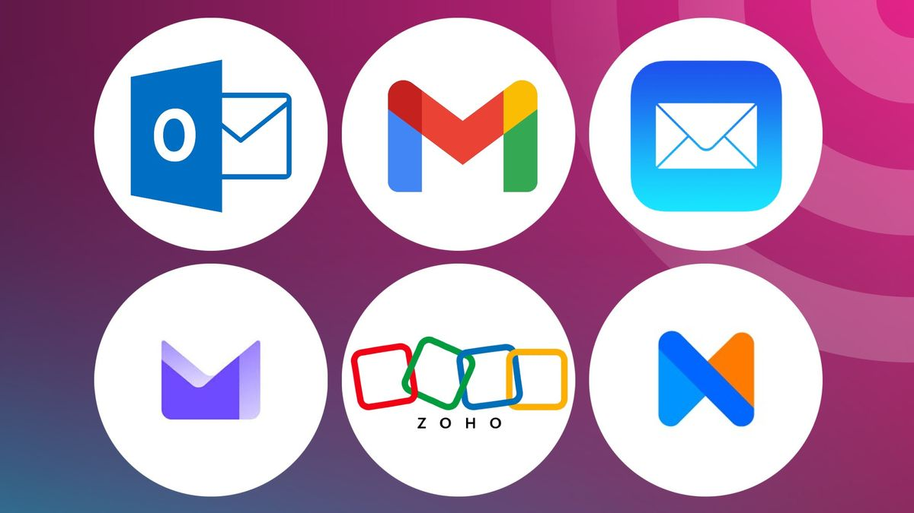
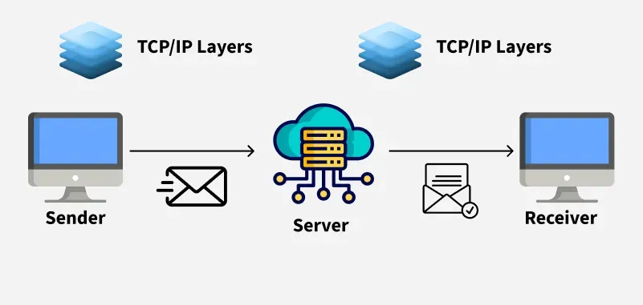
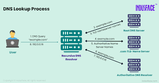
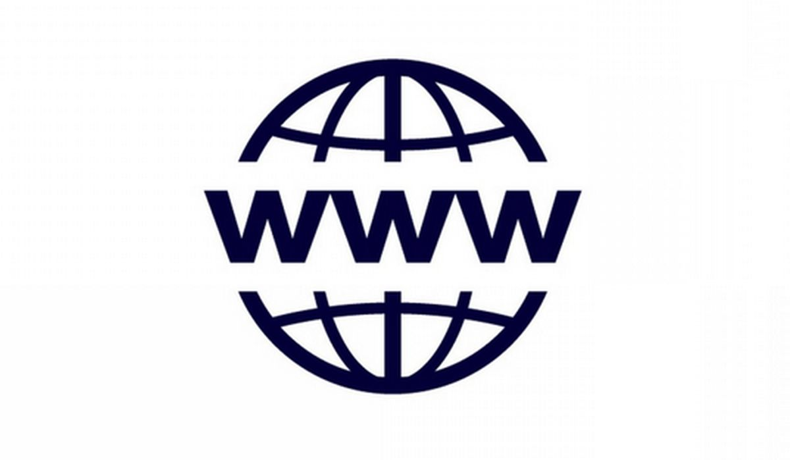
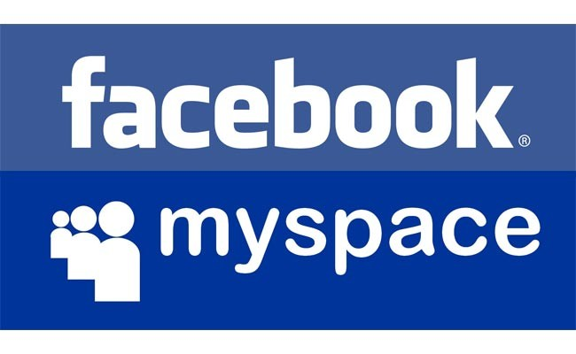

# Digital-History-Notebook

[Ada Lovelace](ada-lovelace)

[Alan Turing](alan-turing)

[Bill Gates](bill-gates.md)

[Steve Jobs](steve-jobs.md)

Timeline: The Rise of the Internet
  # ARPANET 
  # Email 
  # TCP/IP 
  # DNS 
  # World Wide Web 
  # First Social Media (Facebook/MySpace) 
  # Online entertainment, e-commerce, and cybersecurity importance. 
